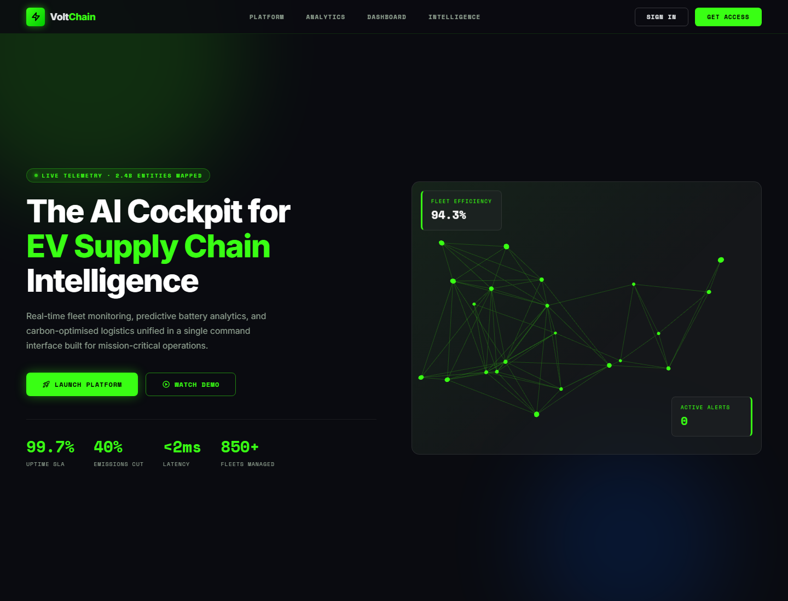

# VoltChain

AI-powered EV supply chain intelligence dashboard — built for mission-critical operations.

## Project Preview



## What It Includes

- **Static frontend** — live EV supply chain visualizations, D3 force-directed Neural Knowledge Graph, interactive Temporal Time Capsule scrubber, MCP AI Analyst chat
- **Express 5 backend** — fleet stats, battery telemetry, SSE live stream, AI chat, QMS quality, supply-chain graph, maintenance schedule, timeline snapshots
- **Reliability hardened** — per-connection SSE state, global crash guards, structured JSON logging, enriched `/health`, input validation
- **Full test suite** — 35+ unit & integration tests with Vitest + Supertest
- **Load test scripts** — SSE concurrent connection test + autocannon REST benchmarks
- **Render Blueprint** — two-service IaC deployment (API + static CDN)

## Clone And Run Locally

```bash
git clone https://github.com/SaurabhForge/VoltChain.git
cd VoltChain
npm install
npm start
```

Open: `http://localhost:3000`

## Local API Endpoints

```
GET  /health
GET  /api/fleet/stats
GET  /api/battery/telemetry
GET  /api/telemetry/stream         ← Server-Sent Events (live telemetry)
POST /api/analyst/chat             ← MCP AI Analyst
GET  /api/qms/quality
GET  /api/supply-chain/nodes       ← D3 Knowledge Graph data
GET  /api/maintenance/schedule
GET  /api/timeline/snapshot?period=TODAY   ← Temporal Time Capsule
```

Valid `period` values: `Q1-2024` | `Q2-2024` | `Q3-2024` | `TODAY` | `PREDICTIVE`

## Run Tests

```bash
# Install dev dependencies first
npm install

# Run all unit + integration tests
npm test

# Run with coverage report
npm run test:coverage

# Watch mode during development
npm run test:watch
```

## Load & Stress Testing

Start the server first (`npm start`), then in a second terminal:

```bash
# SSE: 50 concurrent clients for 20 seconds
npm run load:sse

# REST: 100 concurrent connections, 10 pipelined requests
npm run load:rest

# Chat POST: 20 concurrent clients for 15 seconds
npm run load:chat
```

## Deploy On Render

This repo includes a `render.yaml` Blueprint with two services:

- `saurabhforge-voltchain-api` — Node/Express backend
- `saurabhforge-voltchain-frontend` — Static frontend (CDN)

The frontend build writes `frontend/config.js` from `VOLTCHAIN_API_BASE`, so the hosted frontend automatically points to:

```
https://saurabhforge-voltchain-api.onrender.com
```

## Architecture

```
Browser ──HTTPS──▶ Static CDN (frontend/)
                       │ SSE / REST / fetch
                   Express Backend (server.js)
                       ├─ /health              ← uptime + memory
                       ├─ /api/fleet/stats
                       ├─ /api/battery/telemetry
                       ├─ /api/telemetry/stream  ← SSE (per-connection state)
                       ├─ /api/analyst/chat      ← MCP AI Analyst
                       ├─ /api/qms/quality
                       ├─ /api/supply-chain/nodes
                       ├─ /api/maintenance/schedule
                       └─ /api/timeline/snapshot  ← Time Capsule
```

## Reliability Claims

| Claim | Mechanism |
|-------|-----------|
| 99.7% uptime | Render managed infra + SSE auto-reconnect + local telemetry fallback |
| <2ms latency | Pure in-memory ops, no DB I/O (validated with autocannon) |
| Graceful degradation | Chat & telemetry both have client-side fallbacks |
| No memory leaks | Per-connection SSE intervals cleared on `req.close` |
| Crash resilience | `uncaughtException` + `unhandledRejection` handlers |
